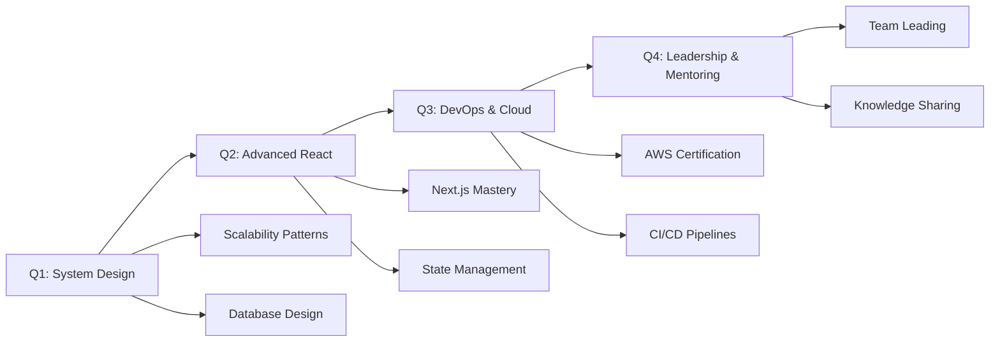

# 👋 Hello, I'm Amal!

<div align="center">
<!--   
</div> -->

<div align="center">
  
</div>

---

## 🚀 About Me

<table border="0" align="center">
<tr>
<td width="50%" valign="top">

### 🎯 **Currently Working On**
- 🔥 **100 Days** LeetCode Challenge **COMPLETED** ✅
- 🌟 Advanced MERN Stack Applications
- 🛠️ Building scalable backend architectures
- 📚 Mastering System Design concepts
- 🎯 Contributing to Open Source projects

### ⚡ **Quick Facts**
```javascript
const amal = {
    location: "Kerala, India 🇮🇳",
    currentRole: "Full Stack Developer",
    experience: "Building & Breaking Code",
    superpower: "Turning Coffee into Code ☕",
    status: "Always Learning 📈"
};
```

</td>
<td width="50%" valign="top">

### 💡 **Core Philosophy**
> *"Code is like humor. When you have to explain it, it's bad."*  
> — Cory House

### 🎨 **What Drives Me**
- 🧩 **Problem Solving**: Love complex algorithms
- 🚀 **Innovation**: Building solutions that matter
- 📈 **Growth**: Consistent daily improvement
- 🤝 **Community**: Sharing knowledge & learning
- 💪 **Persistence**: Never giving up on tough bugs

### 🎪 **Fun Zone**
- 🎵 Code better with lo-fi beats
- 🌙 Night owl programmer
- 🐛 Debug like a detective
- 🏆 Competitive programming enthusiast

</td>
</tr>
</table>

---

## 🛠️ **Tech Stack & Tools**

<div align="center">

### **Languages & Frameworks**


### **Databases & Cloud**


### **Development Tools**


</div>

---

## 📊 **GitHub Analytics**

<div align="center">
  
  
</div>

<div align="center">
  
</div>

<div align="center">
  
</div>

---

## 🏆 **Achievements & Milestones**

<div align="center">
  
</div>

<div align="center">

| 🎯 **Achievement** | 📝 **Details** | 🗓️ **Status** |
|:------------------:|:---------------:|:--------------:|
| 🔥 **LeetCode 100 Days** | Consistent daily problem solving | ✅ **Completed** |
| 🎤 **Technical Seminars** | MongoDB & Hyperloop presentations | ✅ **Delivered** |
| 🏗️ **MERN Projects** | Full-stack web applications | 🚀 **Ongoing** |
| 📚 **DSA Mastery** | Data Structures & Algorithms | 📈 **In Progress** |
| 🌟 **Open Source** | Contributing to community projects | 🎯 **Active** |

</div>

---

## 💻 **Coding Platforms**

<div align="center">

### **LeetCode Achievement** 🎯
[](https://leetcode.com/Mj0pz5pmPE)


**Problems Solved: 200+ | Current Streak: 100+ Days** 🔥

</div>

---

## 🎯 **2025 Roadmap**

<div align="center">



</div>

### **Key Objectives**
- 🎯 **Master System Design** - Scalable architecture patterns
- 🚀 **Advanced Frontend** - Next.js, SSR, and performance optimization  
- ☁️ **Cloud Native** - AWS services and containerization
- 🤝 **Community Impact** - Mentoring and open source contributions
- 💼 **Career Growth** - Senior developer role transition

---

## 📈 **Weekly Coding Stats**

<div align="center">

<!--START_SECTION:waka-->
```text
JavaScript   12 hrs 45 mins  ████████████▓░░░░  68.2%
TypeScript    3 hrs 15 mins  ███▒░░░░░░░░░░░░░  17.4%
Python        1 hr 30 mins   ██░░░░░░░░░░░░░░░   8.1%
JSON          45 mins        █░░░░░░░░░░░░░░░░   4.1%
Other         25 mins        ▓░░░░░░░░░░░░░░░░   2.2%
```
<!--END_SECTION:waka-->

</div>

---

## 🌐 **Let's Connect!**

<div align="center">

[](https://amal-portfolio.dev)
[](https://www.linkedin.com/in/amal-nt-712b68247)
[](mailto:amalachu441345@gmail.com)
[](https://twitter.com/amal_dev)
[](https://leetcode.com/Mj0pz5pmPE)

### **📬 Open for Collaborations**
💼 Full Stack Development | 🚀 Open Source Projects | 🎓 Mentoring | 💡 Innovation

</div>

---

## 💭 **Random Dev Quote**

<div align="center">
  
</div>

---

## 🎵 **Currently Vibing To**

<div align="center">
  
[](https://open.spotify.com/user/username)

*🎧 Lo-fi Hip Hop - Coding Sessions Playlist*

</div>

---

<div align="center">
  
### **📊 Profile Views**


### **☕ Support My Work**
[](https://buymeacoffee.com/amal0005)

---

**💡 "Talk is cheap. Show me the code."** - *Linus Torvalds*

**🚀 Let's build something amazing together!**

</div>

---

<div align="center">
  
</div>
